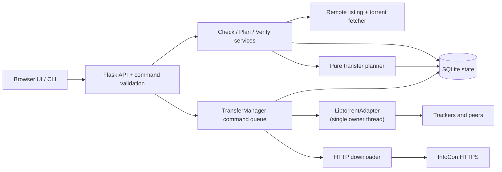

# InfoCon Librarian — Phased Implementation Plan

**Companion document:** `infocon-librarian-product-spec.md`  
**Audience:** an implementation agent or engineering team  
**Target:** a tested local desktop application that maintains an existing InfoCon archive using torrents first and HTTPS only as a controlled fallback.

This is a build plan, not a brainstorm. Implement phases in order. A phase is complete only when its listed tests pass and its exit criteria are met.

## 0. Decisions locked before implementation

| Area | Decision |
|---|---|
| Runtime | Python 3.11+; target CPython 3.11 and 3.12 in CI. |
| UI | Flask local server with plain HTML/CSS/JavaScript; no CDN, bundler, or third-party browser assets. |
| Torrent engine | **libtorrent 2.0.x Python bindings**, packaged with the application; access it only through `LibtorrentAdapter`. Do not implement BitTorrent protocol or bencode parsing for transfers. |
| Persistence | SQLite for durable state, plus the torrent engine's opaque resume data files. JSON only for exported receipts/plans. |
| HTTP | `urllib.request` or `httpx`; select one and use it everywhere. This plan assumes `httpx` for clear timeout and test transport support. |
| Test runner | `pytest`, `pytest-cov`, Playwright for browser end-to-end tests. |
| Process model | One Python process. A single `TransferManager` worker owns all libtorrent calls; Flask request threads communicate with it through typed commands and database state. |
| Listening | Flask binds only to loopback. Torrent networking binds to the normal user-selected network interface; it must never reuse the Flask listener. |
| Release scope | macOS first; Linux and Windows are supported only after packaging and integration tests succeed on those platforms. |

### Why libtorrent is the selected engine

libtorrent has maintained Python bindings and exposes torrent metainfo parsing, selected-file priorities, alerts, resume state, rate controls, and per-feature controls for DHT/PEX/local discovery. Its bindings are native and need deliberate packaging, which is why the first phase is an engine spike rather than assuming a `pip install` will work everywhere. [Python bindings](https://libtorrent.org/python_binding.html), [settings reference](https://www.libtorrent.org/reference-Settings.html)

Pin the exact libtorrent version only after the spike succeeds. The lock file, packaged binary provenance, and build instructions must name that exact version.

## 1. Repository layout

```text
infocon-librarian/
├── pyproject.toml
├── README.md
├── docs/
│   ├── product-spec.md
│   ├── implementation-plan.md
│   ├── threat-model.md
│   └── architecture-decisions.md
├── src/infocon_librarian/
│   ├── __init__.py
│   ├── __main__.py
│   ├── cli.py
│   ├── config.py
│   ├── domain/
│   │   ├── models.py
│   │   ├── status.py
│   │   ├── paths.py
│   │   └── errors.py
│   ├── storage/
│   │   ├── database.py
│   │   ├── migrations.py
│   │   ├── repositories.py
│   │   └── receipts.py
│   ├── archive/
│   │   ├── root.py
│   │   ├── inventory.py
│   │   ├── snapshot.py
│   │   └── search.py
│   ├── remote/
│   │   ├── client.py
│   │   ├── fancyindex.py
│   │   ├── discovery.py
│   │   └── cache.py
│   ├── torrent/
│   │   ├── adapter.py
│   │   ├── libtorrent_adapter.py
│   │   ├── metainfo.py
│   │   ├── policy.py
│   │   └── resume.py
│   ├── transfer/
│   │   ├── planner.py
│   │   ├── manager.py
│   │   ├── http_downloader.py
│   │   ├── progress.py
│   │   └── preflight.py
│   ├── services/
│   │   ├── check_service.py
│   │   ├── verify_service.py
│   │   ├── plan_service.py
│   │   └── receipt_service.py
│   ├── web/
│   │   ├── app.py
│   │   ├── auth.py
│   │   ├── api.py
│   │   └── static/
│   │       ├── index.html
│   │       ├── app.js
│   │       └── style.css
│   └── resources/
│       └── migrations/
├── tests/
│   ├── unit/
│   ├── integration/
│   ├── e2e/
│   ├── fixtures/
│   │   ├── listings/
│   │   ├── torrents/
│   │   └── archives/
│   └── support/
│       ├── fake_engine.py
│       ├── fake_remote.py
│       ├── local_tracker.py
│       └── factories.py
└── scripts/
    ├── package-macos.sh
    └── generate-test-torrents.py
```

Keep `domain/`, `planner.py`, path validation, and receipt generation independent of Flask and libtorrent. Those areas must be fast deterministic unit tests.

## 2. Architecture and ownership boundaries



### Non-negotiable invariants

1. Browser input never becomes a remote URL or filesystem path. It can name only a server-issued ID from the active plan.
2. The planner decides transfer method before a job starts. A job may not silently switch from torrent to HTTPS.
3. Only `TransferManager` calls the torrent adapter. Flask handlers never call libtorrent directly.
4. All archive destinations are validated both while planning and immediately before writing.
5. A completed torrent is not `Piece-verified` until a final recheck completes successfully.
6. HTTPS completion is `Downloaded, unverified` unless a trusted checksum or a matching torrent recheck proves the result.
7. Test suites never contact InfoCon, public trackers, DHT, PEX, or the public internet.

## 3. Domain contracts

Implement these as frozen dataclasses or equivalent immutable value objects. Serialize through explicit mapper functions; do not return raw ORM/database rows from services.

```python
class EvidenceKind(StrEnum):
    REMOTE_LISTING = "remote_listing"
    TORRENT_MANIFEST = "torrent_manifest"
    TORRENT_RECHECK = "torrent_recheck"
    LOCAL_SNAPSHOT = "local_snapshot"
    HTTP_RESULT = "http_result"

class ArchiveStatus(StrEnum):
    NEW = "new"
    CHANGED_MARKER = "changed_marker"
    CHANGED_MANIFEST = "changed_manifest"
    VERIFIED_CURRENT = "verified_current"
    PRESENT_UNVERIFIED = "present_unverified"
    UNKNOWN = "unknown"
    LOCAL_ONLY = "local_only"
    TRANSFER_INCOMPLETE = "transfer_incomplete"
    DOWNLOADED_UNVERIFIED = "downloaded_unverified"

class TransferMethod(StrEnum):
    TORRENT = "torrent"
    HTTPS = "https"

class VerificationLevel(StrEnum):
    PIECE_VERIFIED = "piece_verified"
    MANIFEST_VERIFIED = "manifest_verified"
    UNVERIFIED = "unverified"

class TransferState(StrEnum):
    DRAFT = "draft"
    PREFLIGHTED = "preflighted"
    QUEUED = "queued"
    CHECKING = "checking"
    DOWNLOADING = "downloading"
    PAUSED = "paused"
    AWAITING_USER_FALLBACK = "awaiting_user_fallback"
    COMPLETE = "complete"
    FAILED = "failed"
    CANCELED = "canceled"
```

Required value objects: `ArchiveRoot`, `CollectionKey`, `RemoteEntry`, `TorrentManifest`, `TorrentFile`, `DiscoverySettings`, `PlanItem`, `TransferPlan`, `TransferProgress`, `Receipt`, and `Evidence`.

### Stable identities

- `ArchiveRoot.id`: UUID persisted with stable volume fingerprint and canonical root path.
- `CollectionKey`: `(section, normalized remote collection key)`, never a display label alone.
- `RemoteEntry.id`: SHA-256 of canonical upstream URL; not of decoded display text.
- `TorrentManifest.id`: v1/v2 infohash plus canonical torrent URL. Retain both hashes for hybrid torrents.
- `TransferPlan.id` and `TransferItem.id`: UUIDs. They are the only IDs accepted by API mutation routes.

## 4. Storage schema

Use SQLite in WAL mode with foreign keys enabled. Store filesystem paths relative to `archive_root.path`; absolute paths exist only in process memory/config.

| Table | Key columns | Purpose |
|---|---|---|
| `archive_roots` | `id`, `canonical_path`, `volume_fingerprint`, `last_seen_at` | Known archive destinations. |
| `snapshots` | `id`, `archive_root_id`, `created_at`, `kind` | Inventory revisions. |
| `snapshot_entries` | `snapshot_id`, `relative_path`, `size`, `mtime_ns` | Local file inventory. |
| `remote_fetches` | `url`, `fetched_at`, `etag`, `last_modified`, `body_hash` | Cached upstream listing metadata. |
| `remote_entries` | `id`, `url`, `parent_url`, `kind`, `size_hint`, `modified_hint` | Parsed directory listing entries. |
| `torrent_manifests` | `id`, `url`, `raw_path`, `v1_infohash`, `v2_infohash`, `metadata_hash` | Fetched torrent identity. |
| `torrent_files` | `manifest_id`, `index`, `relative_path`, `size` | Exact manifest membership. |
| `evidence` | `id`, `collection_key`, `kind`, `payload_json`, `observed_at` | Explainable states. |
| `plans` | `id`, `archive_root_id`, `state`, `created_at` | Reviewed but immutable transfer plan header. |
| `plan_items` | `id`, `plan_id`, `method`, `status`, `destination_relpath`, `fallback_reason` | Executable transfer intent. |
| `jobs` | `id`, `plan_item_id`, `state`, `resume_ref`, `last_error` | Resumable run state. |
| `receipts` | `id`, `plan_id`, `json_path`, `completed_at` | Auditable result. |

Migrations are append-only, exercised from an empty database and the immediately preceding released schema.

## 5. Phase 0 — Torrent-engine feasibility spike

**Goal:** prove a packageable libtorrent integration before any product UI is built.

### Work

1. Create the Python project and lock development dependencies.
2. Build or obtain libtorrent Python bindings for target macOS architectures in a clean environment.
3. Add a minimal `LibtorrentAdapter` with:
   - `inspect(torrent_bytes) -> TorrentManifest`;
   - `start(params) -> EngineJobId`;
   - `pause`, `resume`, `remove_keep_data`, `recheck`, `poll`, and `save_resume_data`;
   - per-file priority selection;
   - per-torrent DHT/PEX/LSD disable flags and session-global rate limits.
4. Generate deterministic local v1, v2/hybrid, multi-file, and invalid torrent fixtures. Check the fixture source data and expected hashes into the repository; do not generate fixtures at test time except in the fixture-maintenance script.
5. Run a two-session loopback swarm test: one local session seeds fixture data, one downloads a selected subset. Disable DHT, PEX, LSD, UPnP, NAT-PMP, and public tracker use.
6. Record architecture decision `ADR-001: Libtorrent adapter and packaging strategy`. If this cannot be packaged reliably, stop and replace the engine choice before Phase 1.

### Exit criteria

- `inspect()` returns exact files, sizes, trackers, and stable infohashes for v1 and hybrid fixtures.
- The selected subset downloads over loopback and passes a recheck.
- Resume data survives a process restart and resumes the local test transfer.
- The test confirms DHT/PEX/LSD are disabled by inspecting adapter configuration and no external sockets are attempted.
- A documented macOS packaging command produces an executable that imports the bindings on a clean test VM or CI runner.

### Tests

| ID | Test | Expected result |
|---|---|---|
| TE-001 | Inspect valid v1 multi-file torrent | Exact file list, sizes, tracker URLs, v1 infohash. |
| TE-002 | Inspect hybrid torrent | v1 and v2 identities captured; v2-only fields accepted. |
| TE-003 | Inspect malformed bencode | Typed `InvalidTorrent` error; no engine session/network activity. |
| TE-004 | Start with file priorities | Only requested files exist after completion. |
| TE-005 | Existing data recheck | Valid pieces are recognized before any download; corrupt byte is detected. |
| TE-006 | Pause/restart/resume | Resume state restores and reaches completion. |
| TE-007 | Default privacy settings | DHT, PEX, LSD, UPnP, NAT-PMP disabled; no extra trackers injected. |
| TE-008 | Seed expiry | A time-bounded seed is paused/removed when expiry passes. |

## 6. Phase 1 — Foundation, archive roots, state, and local security

**Goal:** establish safe local state and a secure local shell before remote or torrent transfer logic.

### Work

1. Implement configuration directories with platform-appropriate paths (`platformdirs`). Store only user configuration, cache, resume state, and receipts there.
2. Add SQLite migrations and repositories from section 4.
3. Implement `ArchiveRootValidator`:
   - resolve/canonicalize configured root;
   - require directory and writable probe file;
   - capture volume fingerprint (`st_dev` plus platform volume metadata where available);
   - reject archive roots nested inside app data;
   - detect expected top-level InfoCon sections as advisory, not a hard requirement;
   - report free bytes and read-only/disconnected state.
4. Implement `SafeArchivePath` mapping. It receives a root plus URL/torrent path components and returns a destination only when all containment and collision rules pass.
5. Build the Flask app factory, loopback-only server launcher, startup token bootstrap, and CSRF/origin middleware:
   - launcher opens `http://127.0.0.1:<port>/bootstrap/<random-token>`;
   - bootstrap validates the one-time token, sets a `Secure` where applicable, `HttpOnly`, `SameSite=Strict` session cookie, then redirects to `/`;
   - state-changing API requests require same-origin `Origin`, session cookie, and a CSRF header;
   - every response includes restrictive CSP and no permissive CORS headers.
6. Add health endpoint and a minimal page reporting root/config state.
7. Implement CLI command parsing and structured error exits: `check`, `plan`, `verify`, `sync`, `receipts` may be stubs until their phase, but flags and help text must be stable.

### Tests

| ID | Test | Expected result |
|---|---|---|
| F-001 | New database migration | Schema is current and foreign keys are enabled. |
| F-002 | Reopen upgraded database | Data survives migration from previous schema fixture. |
| F-003 | Writable root | Validator returns canonical root, volume ID, and free-space value. |
| F-004 | Read-only or disconnected root | Validator returns actionable typed failure and writes nothing. |
| F-005 | `..`, absolute, empty, NUL path components | All are rejected. |
| F-006 | Symlink escaping root | Destination is rejected at planning and write time. |
| F-007 | Case collision | Returns a resolution-required conflict on a case-insensitive fixture. |
| F-008 | Flask binding | Server is reachable on loopback; connection to non-loopback is not opened. |
| F-009 | Token bootstrap | Valid token creates session then cannot be reused. |
| F-010 | CSRF/origin protection | Missing/bad origin or token receives 403; valid same-origin request succeeds. |
| F-011 | Raw path API payload | Mutation route rejects unknown fields and never receives an arbitrary path/URL. |

### Exit criteria

- A user can select a root, reopen it on a later run, and see health state.
- No state-changing HTTP route is accessible without a bootstrapped local session and CSRF protection.
- All path validation tests pass on the target platform.

## 7. Phase 2 — Local inventory and upstream discovery

**Goal:** create explainable change candidates without claiming that folder presence proves correctness.

### Work

1. Implement `LocalInventory` using `os.scandir()` and iterative traversal. Persist root-relative file entries, size, mtime nanoseconds, and stable collection grouping.
2. Inventory is cancellable, emits progress, ignores the application’s own data directory, and does not follow symlinked directories.
3. Implement fancyindex parser as a pure HTML parser:
   - retain raw relative href and canonical URL;
   - ignore parent, sort, anchor, and off-host links;
   - parse display text/title only as display metadata;
   - parse listing sizes/dates as optional hints.
4. Implement remote client timeouts, descriptive user agent, capped concurrent listing fetches, retry/backoff for transient errors, and conditional caching when ETag/Last-Modified exist.
5. Implement torrent discovery independent of filename convention: identify `.torrent` links, fetch and inspect them lazily, then associate them with a collection only when their manifest membership/path mapping supports it. Preserve version-marker parsing as a ranking hint only.
6. Implement `CheckService` to create candidate states and evidence:
   - no local collection -> `New`;
   - remote marker/manifest differs -> `Changed — release marker` or `Changed — manifest`;
   - local presence alone -> `Present, unverified`;
   - no enough upstream evidence -> `Unknown`;
   - local absent upstream -> `Local only`.
7. Implement `infocon-librarian check` human and JSON output.

### Tests

| ID | Test | Expected result |
|---|---|---|
| D-001 | Fancyindex sort links and parent row | Not returned as remote entries. |
| D-002 | Encoded names and HTML entities | Raw href remains canonical; display label is decoded correctly. |
| D-003 | Off-host absolute link | Rejected. |
| D-004 | Missing size/date cells | Entry parses with `None` hints. |
| D-005 | HTTP transient failures | Bounded retries with backoff; final typed error after exhaustion. |
| D-006 | Conditional cache hit | Cached listing used only when policy permits; timestamp/evidence preserved. |
| D-007 | Inventory with 100k generated paths | Bounded memory target and cancellable progress; no recursion overflow. |
| D-008 | Existing incomplete folder | Status is `Present, unverified`, never verified/current. |
| D-009 | Remote collection absent locally | Status is `New` with remote evidence. |
| D-010 | Local-only collection | Status is `Local only`; no delete operation is emitted. |
| D-011 | Versioned torrent marker changed | Candidate state shows old/new marker but does not claim piece verification. |
| D-012 | Skills-like collection without torrent | State is `Unknown` or `Present, unverified`, not unchanged. |

### Exit criteria

- Check works against captured HTML fixtures and an arbitrary local root without a torrent engine network transfer.
- Every displayed status has at least one persisted evidence object.
- No user-facing `Unchanged` state exists.

## 8. Phase 3 — Torrent metainfo, verification, and controlled swarm transfers

**Goal:** turn published torrents into the authoritative path/size manifest and verified transfer route.

### Work

1. Complete `LibtorrentAdapter` behind a protocol/interface used by services and replace it with `FakeTorrentEngine` in unit tests.
2. Implement `TorrentMetainfoService`:
   - cache raw `.torrent` content keyed by metadata SHA-256 and infohash;
   - inspect without joining a swarm;
   - normalize torrent file paths through `SafeArchivePath`;
   - reject malformed, unsupported, and unsafe metainfo with a stored reason;
   - persist exact torrent files/sizes and tracker host/protocol list.
3. Implement `VerifyService`:
   - build a recheck request from an existing collection and manifest;
   - transition `PRESENT_UNVERIFIED` -> `CHECKING` -> `VERIFIED_CURRENT` or a failure/changed state;
   - persist recheck timestamp, selected files, and infohash evidence;
   - do not allow a recheck job to start network transfer until the transfer plan says so.
4. Implement `TransferManager` as a single owning worker thread:
   - accepts typed commands from a queue;
   - polls engine alerts/status on a short interval;
   - coalesces progress updates;
   - serializes libtorrent resume data on pause, shutdown, and meaningful state changes;
   - writes job transitions transactionally;
   - redacts peer addresses from normal logs/UI.
5. Map product privacy controls to adapter settings. Start all torrents paused, apply settings, set selected file priorities, perform existing-data recheck, then start only after preflight confirms the reviewed plan.
6. On torrent completion, run final recheck. If it fails, mark failed and retain data/resume state for diagnosis; do not issue a success receipt.

### Tests

| ID | Test | Expected result |
|---|---|---|
| T-001 | Unsafe v1 path in fixture | Metainfo rejected before engine add. |
| T-002 | Unsafe v2 file-tree path | Metainfo rejected before engine add. |
| T-003 | Valid multi-file mapping | Exact root-relative destinations and exact total bytes. |
| T-004 | Collection only partly covered by torrent | Planner marks uncovered selected files as HTTPS candidates, not torrent items. |
| T-005 | Existing valid data | Recheck yields verified pieces and no redownload. |
| T-006 | Existing corrupt data | Recheck detects corruption; only invalid pieces are acquired in loopback test. |
| T-007 | Privacy controls | Adapter call includes DHT/PEX/LSD disabled and no tracker injection. |
| T-008 | Pause and app restart | Resume blob is saved, restored, and job continues. |
| T-009 | Completion alert without final recheck | Job is not marked `Piece-verified`. |
| T-010 | Final recheck succeeds | Receipt candidate has `Piece-verified`, selected files, and infohash. |
| T-011 | Tracker failure/no peers | Job transitions to retryable failure/awaiting user fallback; no HTTPS job is created. |
| T-012 | Engine alert flood | Manager coalesces updates and remains responsive; database does not receive unbounded rows. |

### Exit criteria

- Local integration swarm tests cover download, selection, recheck, resume, and no-peer failure.
- Torrent failures cannot create HTTP transfer jobs without an explicit planner command.
- All torrent metadata is path-validated before the engine sees it.

## 9. Phase 4 — Plan builder, preflight, and HTTPS fallback

**Goal:** make transfer decisions auditable and safe before writing data.

### Work

1. Implement a pure `TransferPlanner` with inputs: selected collection/file IDs, current evidence, local snapshot, torrent manifests, root capabilities, and user policy.
2. Planner method rules:
   - valid supported torrent covers a selected file -> torrent item;
   - no usable torrent covers a selected file -> HTTPS fallback item with machine-readable reason;
   - torrent exists but tracker/peer transfer failed -> `AWAITING_USER_FALLBACK`, no automatic HTTPS item;
   - a selected group may split into torrent and HTTPS items only when the plan displays that split clearly.
3. `PreflightService` verifies archive root still matches volume identity, checks free bytes plus temporary overhead, revalidates all destinations, checks existing-file conflicts, and generates an immutable plan revision.
4. Implement direct HTTPS remote tree crawl only for items that need fallback. Do not deep-crawl the entire archive as part of every check.
5. Implement `HttpDownloader`:
   - fixed known URLs and safe destination from a plan item only;
   - `.part` and sidecar state in the destination directory or controlled same-volume area;
   - issue Range only for an existing matching sidecar;
   - require response `206` and exact matching `Content-Range` before append;
   - if a range is ignored or remote metadata changed, quarantine partial state and return an actionable state;
   - atomically rename only after a clean transfer;
   - mark output unverified unless a trusted hash/manifest verifies it.
6. Add receipt generation on every terminal plan state. A partial plan writes a receipt with unfinished/error items.

### Tests

| ID | Test | Expected result |
|---|---|---|
| P-001 | Valid torrent covers selection | Planner produces torrent item and exact bytes. |
| P-002 | No torrent exists | Planner produces HTTPS fallback with `NO_TORRENT` reason. |
| P-003 | Torrent malformed/unsupported | HTTPS fallback has a precise reason and retained discovery evidence. |
| P-004 | Torrent no-peer failure | Planner requires explicit `approve_http_fallback`; default plan remains blocked. |
| P-005 | Mixed coverage | Plan groups selected files by transfer method and totals both accurately. |
| P-006 | Disk shortfall | Preflight fails before transfer starts and reports required/available bytes. |
| P-007 | Drive swapped after planning | Preflight refuses execution due to volume mismatch. |
| P-008 | Existing matching file | Plan item is skipped only with exact trusted manifest/verification evidence; listing-size equality alone is not enough. |
| P-009 | HTTP starts fresh | Writes `.part`, emits progress, atomically finalizes, state is unverified. |
| P-010 | Valid HTTP range resume | Sends Range, receives matching 206/content-range, appends correctly. |
| P-011 | Server returns 200 to range | Does not append; partial is quarantined and job requires restart. |
| P-012 | Remote metadata changes before resume | Does not resume stale partial. |
| P-013 | Receipt redaction | Contains root-relative paths and required evidence but no peer IPs or unrelated absolute paths. |

### Exit criteria

- A dry run produces the same immutable plan that execution would use, including method and verification labels.
- No transfer starts until preflight has run against current root state.
- HTTP has no path from “stream ended” to “verified.”

## 10. Phase 5 — Complete GUI and CLI workflows

**Goal:** expose the completed system in a clear, accessible local interface.

### Work

1. Implement JSON API with server-issued IDs only:

| Method | Route | Behaviour |
|---|---|---|
| `GET` | `/api/health` | Root, engine, and database health. |
| `POST` | `/api/checks` | Start/check using section filters. |
| `GET` | `/api/checks/<id>` | Progress and evidence-backed results. |
| `POST` | `/api/verifications` | Verify selection by collection IDs. |
| `POST` | `/api/plans` | Create plan from selection IDs/policy IDs. |
| `GET` | `/api/plans/<id>` | Full reviewed plan. |
| `POST` | `/api/plans/<id>/start` | Preflight then queue. |
| `POST` | `/api/items/<id>/pause` | Pause item. |
| `POST` | `/api/items/<id>/resume` | Resume item. |
| `POST` | `/api/items/<id>/approve-http-fallback` | Explicitly permit fallback after torrent failure. |
| `GET` | `/api/events` | Authenticated SSE with job state/progress deltas. |
| `GET` | `/api/receipts/<id>` | Read/export receipt. |

2. Build the home change feed, evidence drawer, search/filter controls, plan review, transfer panel, receipts view, and tree navigation.
3. Use semantic HTML: buttons for actions, `<details>` where appropriate, labelled checkboxes, `<progress>`, and concise ARIA live regions for terminal state—not per-byte chatter.
4. Add UI privacy disclosure before a torrent plan is approved and show tracker hosts, discovery settings, upload limit, and post-completion seeding choice.
5. Implement CLI commands against the same services/repositories, not HTTP calls. `--format json` returns documented schemas for check/plan/receipt commands.
6. Add error presentation for drive disconnect, locked database, invalid torrent, no peers, tracker error, insufficient space, and insecure/invalid local session.

### Browser and API tests

| ID | Test | Expected result |
|---|---|---|
| U-001 | Home view with new/unknown/verified fixtures | Status text, counts, and evidence links are visible; no `Unchanged` label. |
| U-002 | Keyboard-only plan flow | User can select, review, start, pause, and inspect receipt without mouse. |
| U-003 | Colour-independent status | Status has text/icon/accessibility name; test does not rely on CSS colour. |
| U-004 | Screen-reader progress | One meaningful status announcement per state change; no event flood. |
| U-005 | Torrent privacy plan | Tracker hosts, DHT/PEX/LSD state, upload cap, and seed choice shown before start. |
| U-006 | No-peer torrent | UI offers retry and explicit HTTPS fallback; it does not start fallback itself. |
| U-007 | HTTP-only item | Plan clearly states why torrent is unavailable and result is unverified. |
| U-008 | SSE reconnect | UI refreshes current state from API and does not duplicate progress. |
| U-009 | Invalid plan/item ID | 404/422, no state mutation. |
| U-010 | API abuse | Payload with URL/path/unknown field is rejected. |
| U-011 | 200% zoom/narrow viewport | Main actions remain visible and usable. |
| U-012 | CLI check/plan/sync dry run | Equivalent state and item IDs to service-level fixture output. |

### Exit criteria

- A first-time user can configure a root, check, inspect evidence, make a plan, complete a local fixture transfer, and export a receipt without a terminal.
- The accessibility and security API tests run in CI.
- UI contains no external network assets.

## 11. Phase 6 — Hardening, packaging, documentation, and release gate

**Goal:** turn the working app into a supportable desktop release.

### Work

1. Add bounded structured logs with redaction; document a support bundle that excludes archive contents, credentials, and peer IPs by default.
2. Add controlled shutdown: stop accepting new commands, pause/flush jobs, request engine resume data, commit database state, then stop server.
3. Test drive removal and remount during every transfer type.
4. Package the app and native torrent engine for macOS. Sign/notarize where distribution requires it. Do not claim Windows/Linux support until their own packaging matrices pass.
5. Produce documentation:
   - installation and archive-root selection;
   - torrent privacy explanation and seeding defaults;
   - network/threat-model statement;
   - troubleshooting no-peer and HTTP fallback cases;
   - how to export receipt/support bundles;
   - license and third-party dependency notices.
6. Create a release checklist and a manual exploratory test script.

### Tests

| ID | Test | Expected result |
|---|---|---|
| R-001 | Graceful shutdown during torrent | Resume state is persisted; next launch continues safely. |
| R-002 | Graceful shutdown during HTTPS | `.part` sidecar is consistent and safe range resume remains possible. |
| R-003 | Drive disconnect | Job pauses/fails safely; no writes occur after root becomes unavailable. |
| R-004 | Drive remount with same ID | User can revalidate and resume; different volume requires fresh confirmation. |
| R-005 | Corrupted database backup/recovery | App preserves original, offers repair/reset path, and does not touch archive data. |
| R-006 | Packaged clean-machine smoke test | Launch, configure fixture root, inspect test torrent, execute loopback transfer. |
| R-007 | Dependency/license audit | Locked artifacts and notices are present; no unexpected network dependency at runtime. |
| R-008 | Security regression suite | Loopback/session/CSRF/path-traversal tests pass against packaged app. |

### Release gate

- Full unit suite, integration suite, browser suite, and packaged smoke test are green.
- Coverage: at least 90% for pure domain/planner/path code; do not use aggregate coverage to hide untested native-engine paths.
- No `xfail` or skipped security/path/transfer tests without an issue, owner, and release decision.
- Manual test confirms no automatic post-completion seeding and no automatic HTTP downgrade.

## 12. Phase 7 — Post-MVP capabilities

Do not delay Phase 1 release for these features.

| Capability | Implementation outline | Tests |
|---|---|---|
| Full-text local catalogue | SQLite FTS index built from snapshot names/paths; incremental updates. | Query ranking, Unicode, stale-index rebuild, large inventory. |
| Portable receipts/plans | Export signed-if-possible JSON bundle with root-relative paths and content hashes of metadata. | Import validation, tamper detection, no absolute-path leak. |
| Scheduled checks | OS scheduler or in-app timer runs **check only** and never starts transfers. | Offline run, missed schedule, no transfer manager commands. |
| Opt-in community seeding | Per-item expiry/ratio/cap, stop control, receipt updates. | No seed by default, expiry, stop immediately, restart persistence. |
| Signed upstream manifests | Verify published signatures and elevate HTTP verification state only after key validation. | Valid key, wrong key, expired/revoked key policy, manifest mismatch. |

## 13. Test strategy and CI matrix

### Test layers

| Layer | Scope | Network rule | Frequency |
|---|---|---|---|
| Unit | Domain, paths, parser, planner, repositories with fakes | No sockets | Every commit |
| Integration | SQLite, Flask app, HTTP test server, fake engine | Loopback only | Every commit |
| Engine integration | Real libtorrent, local seed/downloader sessions | Loopback only; DHT/PEX/LSD disabled | Every commit on macOS target; nightly elsewhere |
| E2E | Playwright local browser against fixture app | Loopback only | Every commit |
| Packaging smoke | Bundled executable plus local fixtures | Loopback only | Release candidate |
| Live compatibility | Read-only check against InfoCon staging/captured new listing | Explicit opt-in, never default CI | Manual/maintainer scheduled |

### Required fixtures

- Fancyindex pages with encoded names, multiple torrents, no torrent, malformed table, off-host link, missing size/date, and changed marker.
- Archive directory trees: complete, incomplete, local-only, symlink escape, case-collision, disconnected simulation.
- Torrent files: v1 single/multi-file, v2/hybrid, selected-file layout, malformed bencode, `..`/absolute/reserved-name attempt, unsupported feature.
- HTTP server behavior: full response, valid range response, ignored range (`200`), incorrect `Content-Range`, connection drop, changed size/ETag, 5xx retry.
- Engine states: checking, downloading, no peers, tracker error, paused, resume data invalid, final recheck failure.

Fixtures must be synthetic or redistributable. Do not commit copyrighted InfoCon media payloads to the repository.

### CI commands

```bash
python -m pytest tests/unit -q
python -m pytest tests/integration -q
python -m pytest tests/engine -q
python -m playwright install --with-deps chromium
python -m pytest tests/e2e -q
python -m ruff check src tests
python -m mypy src
```

Add platform jobs only when supported: macOS is required from Phase 0; Linux/Windows are advisory until the packaged engine smoke test exists for them.

## 14. Implementation order for an agent

An agent should create small, reviewable commits in this order:

1. Project tooling, domain enums/models, SQLite migration harness, and pure path tests.
2. Phase 0 torrent spike and ADR. Stop if the engine cannot be packaged.
3. Archive-root validation, inventory, config, Flask security shell, and associated tests.
4. Fancyindex parser, remote cache/client, local/upstream check service, CLI `check`.
5. Metainfo inspection, database persistence, verification workflow, real-engine loopback tests.
6. Pure transfer planner and preflight; CLI `plan --dry-run`.
7. Transfer manager, torrent job lifecycle, HTTP fallback downloader, receipts.
8. GUI screens and SSE; Playwright/accessibility tests.
9. Shutdown/removable-drive/package hardening and release documentation.

Do not start frontend polish, search, background scheduling, or community seeding before steps 1–7 have acceptance tests passing.

## 15. Definition of done for the initial release

The initial release is done when a packaged macOS build can, using only local test fixtures and then a user-approved real archive:

1. validate an external archive root;
2. discover and explain remote changes without claiming ambiguous content is current;
3. inspect a torrent before contacting its swarm;
4. create a reviewed torrent-first plan with visible privacy/network settings;
5. download selected torrent files, resume interruption, and mark completion only after piece verification;
6. use HTTPS only for a no-usable-torrent item or after explicit user approval following a torrent failure;
7. protect all local write paths and local API mutations;
8. preserve a receipt that explains what happened; and
9. perform the workflow with keyboard-only interaction.

Anything less is a prototype, not an archive-steward release.
